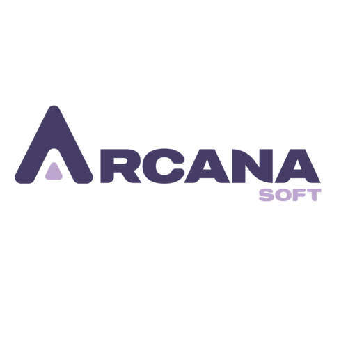

# Arckybot



Arckybot is an AI assistant developed with Streamlit and using the Groq API to answer questions and assist with problem solving.

# Arckybot vs Expert

## Fonctionnalités

- Posez une question liée à une panne ou un problème de maintenance.
- Obtenez une réponse générée par Arckybot.
- Évaluez la qualité de la réponse (Correcte, Partiellement correcte, Incorrecte).
- Proposez votre propre réponse d'expert pour gagner plus de points.
- Système de score gamifié avec une **récompense finale** si vous atteignez 100 points !
- Historique des questions, réponses et évaluations.

## Lancer l'application en local

### 1. Cloner le dépôt

```bash
git clone https://github.com/votre-utilisateur/arckybot-vs-expert.git
cd arckybot-vs-expert
```
## 2. Installer les dépendances
Assurez-vous d’avoir Python 3.9+ installé.
```bash
pip install -r requirements.txt
```
## 3. Configurer la clé API
Créez un fichier .env à la racine du projet et ajoutez votre clé Groq API :
```env
GROQ_API_KEY=your_groq_api_key_here
```
## 4. Lancer l'application
```bash
streamlit run arckybot_app.py
```
## Fichier requirements.txt
```txt
streamlit
requests
python-dotenv
```
## Modèle utilisé
Le modèle utilisé est :
- Nom : llama-3.1-8b-instant
- API : https://api.groq.com/openai/v1/chat/completions
## Objectif du jeu
Vous avez jusqu'à 15 questions pour accumuler 100 points. Évaluez objectivement Arckybot et contribuez avec votre propre expertise. Si vous atteignez 100 points, vous obtenez un code de réduction de 70% 🎁

## Exemples de questions à poser
- Pourquoi mon moteur triphasé surchauffe ?
- Quelles sont les causes d'une pompe qui ne démarre pas ?
- Comment diagnostiquer une panne intermittente sur un automate ?

## À propos
Ce projet a été développé dans un contexte d'exploration de l'IA générative appliquée à la maintenance. Il combine :
- Interaction homme-machine via Streamlit
- IA conversationnelle spécialisée
- Interface ludique et interactive


##  Contact
e-mail address: linathabet101@gmail.com

